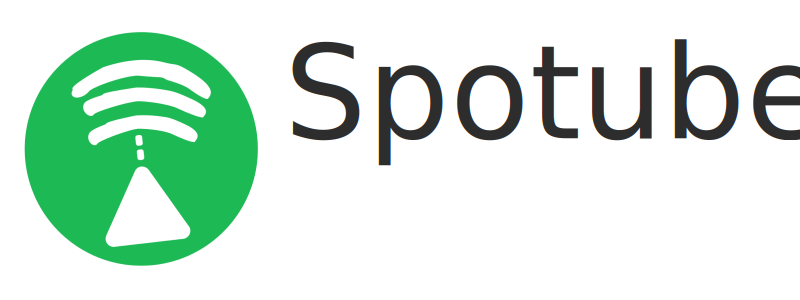

Spotube is a [qt](https://qt.io) based lightweight spotify client which uses [nodegui/react-nodegui](https://github.com/nodegui/react-nodegui) as frontend & nodejs as backend. It utilizes the power of Spotify & Youtube's public API & creates a hazardless, performant & resource friendly User Experience


## Features

Following are the features that currently spotube offers:

- Open Source
- No telementry, diagnostics or user data collection
- Lightweight & resource friendly
- Near native performance & seemless with default desktop themes (Win10, Win7, OSX, QT-default)
- Playback control is on user's machine instead of server based
- Small size & less data hungry
- No spotify or youtube ads since it uses all public & free APIs (But it's recommended to support the creators by watching/liking/subscribing to the artists youtube channel or add as favourite track in spotify. Mostly buying spotify premium is the best way to support their valuable creations)
- Lyric Seek (WIP)

## Requirements

Don't worry **spotify premium isn't required**😱. But some extra packages are required.

- [MPV](https://mpv.io/installation/) player for playing the actual audio
- [youtube-dl](https://github.com/ytdl-org/youtube-dl) for streaming the audio from youtube. It already comes pre bundled with mpv

**Tip!:** If you're using **[Windows]()** try installing **mpv & youtube-dl** player with **[chocolatey](https://chocolatey.org/install) package manager** as it'd make the installation a lot easier.
**But always install youtube-dl first & then mpv player**

**Important for [Ubuntu/Debian]():** If you're using any **ubuntu/debian** based linux distro then **youtube-dl** installed from the typical **apt-get** repositories will most likely not work as that version is older than current release. So remove it & install from the repository manually

Remove the **youtube-dl** installed with **mpv** player or from **apt package manger**

```bash
$ sudo apt-get remove youtube-dl
```

Now, Install youtube-dl from

- official github repo: https://github.com/ytdl-org/youtube-dl#installation (recommended)
**or**
- snap installation

```bash
$ snap install youtube-dl
```

## Installation

I'm always releasing newer versions of binary of the software each 2-3 month with minor changes & each 6-8 month with major changes. Grab the binaries

All the binaries are located in the [releases](https://github.com/krtirtho/spotube/releases), just download & install

**I'll/try to upload the package binaries to linux debian/arch/ubuntu/snap/flatpack/redhat/chocolatey stores or software centers or repositories**

## Configuration

There are some configurations that needs to be done to start using this software

You need a spotify account & a web app for

- clientId
- clientSecret

**Grab credentials:**

- Go to https://developer.spotify.com/dashboard/login & login with your spotify account (Skip if you're logged in)
  

- Create an web app for Spotify Public API
  

- Give the app a name & description. Then Edit settings & add **http://localhost:4304/auth/spotify/callback** as **Redirect URI** for the app. Its important for authenticating
  

- Click on **SHOW CLIENT SECRET** to reveal the **clientSecret**. Then copy the **clientID**, **clientSecret** & paste in the **Spotube's** respective fields
  

**[Important]!**: No personal data or any kind of sensitive information won't be collected from spotify. Don't believe? See the code for yourself

### Building from source

**nodegui/react-nodegui** requires following packages to run

- [CMake](https://cmake.org/install/) 3.1 & up
- GCC v7
- Nodejs 12.x & up

**Windows Specific:**

- Visual Studio 2019

**MacOS & Linux specific:**

- Make

**Ubuntu/Debian based linux specific:**
Having `pkg-config build-essential mesa-common-dev libglu1-mesa-dev` is important

```bash
$ sudo apt-get install pkg-config build-essential mesa-common-dev libglu1-mesa-dev
```

After having this dependencies set up run following commands:

```bash
$ git clone https://github.com/KRTirtho/spotube.git
$ cd spotube
$ npm install
```

Now start building:

```bash
$ npm run build
$ npm run pack
```

Go to built package directory replace `os-name` with `linux`|`win32`|`darwin`:

```bash
$ cd deploy/<os-name>/build/spotube
```

If everything went smoothly then double clicking on the

- `AppRun` or Spotube-x86_64.AppImage for **linux**
- qode.exe for **Windows**
- Spotube-x86_64.dmg for **MacOS**

should work just fine without any problem

### Development

Follow the **Build from Source** guideline till `npm install`
Now, to start the dev server run the command in one terminal:

```bash
$ npm run dev
```

To start the application in development environment run following command in another terminal keeping the dev server running:

```bash
$ npm start
```

## Known Issues

There will be some glitches, lags & stuck motions because of the library Spotube is currently using under the hood. It has some issues with layouts thus sometime some contents aren't shown or overflows out of the window. But resizing the window would fix this issue. Soon there will be some updates fixing this sort of layout related problems

## TODO:

- Compile, Debug & Build for **MacOS**
- Add seek Lyric for currently playing track
- Support for playing/streaming podcasts/shows
- Easy installation procedure/mechanism for simplicity

## Things that don't work
- Shows & Podcasts aren't supported as it'd require premium anyway
- Beautiful UI (you missed it, see the title😂^)
- Images aren't added to ensure the lowest resource usage
- OS Media Controls

#### Social handlers

Follow me on [Twitter](https://twitter.com/@krtirtho) for newer updates about this application
