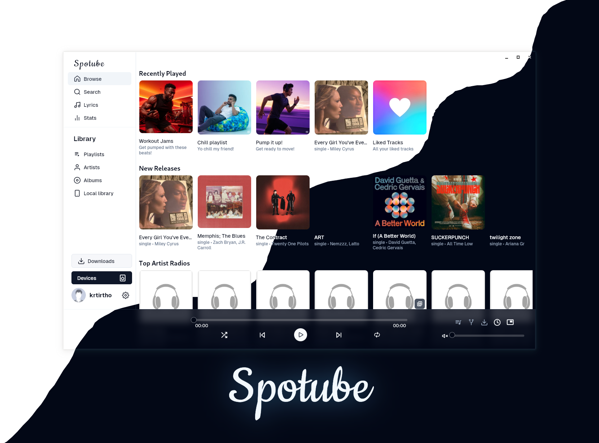

  

A cross-platform extensible open-source music streaming platform. 
Bring your own music metadata/playlist/audio-source with plugins created by community or by yourself. A small step towards the decentralized music streaming era!

Btw it's not just another Electron app 😉

---

## 🌃 Features

- 🧩 Plugin powered, supports any platform or custom music service through plugins.
- 🗺️ Community driven plugins for popular platforms or create your own.
- ⬇️ Freely downloadable tracks with tagged metadata.
- 🖥️ 📱 Cross-platform support.
- 🪶 Small size & less data usage.
- 🕒 Time synced lyrics regardless of the plugin support.
- ✋ No telemetry, diagnostics or user data collection.
- 🚀 Native performance.
- 📖 Open source/libre software.
- 🔉 Playback control is done locally, not on the server.

## 📜 ⬇️ Installation guide

New versions usually release every 3-4 months. 
This handy table lists all the methods you can use to install Spotube:

<table>
  <tr>
    <th>Platform</th>
    <th>Package/Installation Method</th>
  </tr>
  <tr>
    <td>Windows</td>
    <td>
      
  </tr>
  <tr>
    <td>MacOS</td>
    <td>
      
    </td>
  </tr>
  <tr>
    <td>Android</td>
    <td>
      
       
      
    </td>
  </tr>
  <tr>
  <tr>
    <td>iOS</td>
    <td>
      
       
      <blockquote style="color:red">
        *iPA file only. Requires sideloading with <a href="https://altstore.io/">AltStore</a> or similar tools.
      </blockquote>
    </td>
  </tr>
  <tr>
    <td>Flatpak</td>
    <td>
      
<code>flatpak install com.github.KRTirtho.Spotube</code>

      
    </td>
  </tr>
  <tr>
    <td>AppImage</td>
    <td>AppImage's lacking stability led to it's temporary removal. More information at https://github.com/KRTirtho/spotube/issues/1082</td>
  </tr>
  <tr>
    <td>Debian/Ubuntu</td>
    <td>
      
      
Then run: <code>sudo apt install ./Spotube-linux-x86_64.deb</code>

    </td>
  </tr>
  <tr>
    <td>Arch/Manjaro</td>
    <td>
      
With pamac: <code>sudo pamac install spotube-bin</code>

      
With yay: <code>yay -Sy spotube-bin</code>

    </td>
  </tr>
  <tr>
    <td>Fedora/OpenSuse</td>
    <td>
      
      
For Fedora: <code>sudo dnf install ./Spotube-linux-x86_64.rpm</code>

      
For OpenSuse: <code>sudo zypper in ./Spotube-linux-x86_64.rpm</code>

    </td>
  </tr>
  <tr>
    <td>Linux (tarball)</td>
    <td>
      
    </td>
  </tr>
  <tr>
    <td>Macos - <a href="https://brew.sh">Homebrew</a></td>
    <td>
<pre lang="bash">
brew tap krtirtho/apps
brew install --cask spotube
</pre>   
    </td>
  </tr>
  <tr>
    <td>Windows - <a href="https://chocolatey.org">Chocolatey</a></td>
    <td>
      
<code>choco install spotube</code>

    </td>
  </tr>
  <tr>
    <td>Windows - <a href="https://scoop.sh">Scoop</a></td>
    <td>
      
<code>scoop bucket add extras</code>

      
<code>scoop install spotube</code>

    </td>
  </tr>
  <tr>
    <td>Windows - <a href="https://github.com/microsoft/winget-cli">WinGet</a></td>
    <td>
      
<code>winget install --id KRTirtho.Spotube</code>

    </td>
  </tr>
</table>

### 🔄 Nightly Builds

Grab the latest nightly builds of Spotube [from the GitHub Releases](https://github.com/KRTirtho/spotube/releases/tag/nightly).

## 🕳️ Building from source

You can compile Spotube's source code by [following these instructions](CONTRIBUTION.md#your-first-code-contribution).

## 👥 The Spotube team

- [Kingkor Roy Tirtho](https://github.com/KRTirtho) - The Founder, Maintainer and Lead Developer
- [Owen Connor](https://github.com/owencz1998) - The Cool Discord Moderator
- [Piotr Rogowski](https://github.com/karniv00l) - The MacOS Developer
- [Rusty Apple](https://github.com/RustyApple) - The Mysterious Unknown Guy

## 💼 License

Spotube is open source and licensed under the [BSD-4-Clause](/LICENSE) License.

If you are curious, you can [read the reason of choosing this license](https://dev.to/krtirtho/choosing-open-source-license-wisely-1m3p).

  

    <h2><code>[Click to show]</code> 🙏 Services/Package/Plugin Credits</h2>
  

### Services

1. [Flutter](https://flutter.dev) - Flutter transforms the app development process. Build, test, and deploy beautiful mobile, web, desktop, and embedded apps from a single codebase
1. [MPV](https://mpv.io) - mpv is a free (as in freedom) media player for the command line. It supports a wide variety of media file formats, audio and video codecs, and subtitle types.
1. [Musicbrainz](https://musicbrainz.org) - MusicBrainz is a MetaBrainz project that aims to create a collaborative music database that is similar to the freedb project.
1. [Listenbrainz](https://listenbrainz.org) - ListenBrainz is a open-source project by the MetaBrainz Foundation that allows users to crowdsource and publicly store their digital music listening data.
1. [Piped](https://piped-docs.kavin.rocks/) - Piped is a privacy friendly alternative YouTube frontend, which is efficient and scalable by design.
1. [Invidious](https://invidious.io/) - Invidious is an open source alternative front-end to YouTube.
1. [yt-dlp](https://github.com/yt-dlp/yt-dlp) - A feature-rich command-line audio/video downloader.
1. [NewPipeExtractor](https://github.com/TeamNewPipe/NewPipeExtractor) - NewPipe's core library for extracting data from streaming sites.
1. [YouTubeExplodeDart](https://github.com/Hexer10/youtube_explode_dart) - A port in dart of the youtube explode library. Supports several API functions without the need of Youtube API Key.
1. [LRCLib](https://lrclib.net/) - A public synced lyric API.
1. [Linux](https://www.linux.org) - Linux is a family of open-source Unix-like operating systems based on the Linux kernel, an operating system kernel first released on September 17, 1991, by Linus Torvalds. Linux is typically packaged in a Linux distribution
1. [AUR](https://aur.archlinux.org) - AUR stands for Arch User Repository. It is a community-driven repository for Arch-based Linux distributions users
1. [Flatpak](https://flatpak.org) - Flatpak is a utility for software deployment and package management for Linux
1. [SponsorBlock](https://sponsor.ajay.app) - SponsorBlock is an open-source crowdsourced browser extension and open API for skipping sponsor segments in YouTube videos.
1. [Inno Setup](https://jrsoftware.org/isinfo.php) - Inno Setup is a free installer for Windows programs by Jordan Russell and Martijn Laan
1. [F-Droid](https://f-droid.org) - F-Droid is an installable catalogue of FOSS (Free and Open Source Software) applications for the Android platform. The client makes it easy to browse, install, and keep track of updates on your device
1. [LastFM](https://last.fm) - Last.fm is a music streaming and discovery platform that helps users discover and share new music. It tracks users' music listening habits across many devices and platforms.

### Dependencies

1. [app_links](https://github.com/llfbandit/app_links) - Android App Links, Deep Links, iOs Universal Links and Custom URL schemes handler for Flutter (desktop included).
1. [args](https://pub.dev/packages/args) - Library for defining parsers for parsing raw command-line arguments into a set of options and values using GNU and POSIX style options.
1. [audio_service](https://pub.dev/packages/audio_service) - Flutter plugin to play audio in the background while the screen is off.
1. [audio_service_mpris](https://github.com/bdrazhzhov/audio-service-mpris) - audio_service platform interface supporting Media Player Remote Interfacing Specification.
1. [audio_session](https://github.com/ryanheise/audio_session) - Sets the iOS audio session category and Android audio attributes for your app, and manages your app's audio focus, mixing and ducking behaviour.
1. [auto_route](https://github.com/Milad-Akarie/auto_route_library) - AutoRoute is a declarative routing solution, where everything needed for navigation is automatically generated for you.
1. [auto_size_text](https://github.com/leisim/auto_size_text) - Flutter widget that automatically resizes text to fit perfectly within its bounds.
1. [bonsoir](https://bonsoir.skyost.eu) - A Zeroconf library that allows you to discover network services and to broadcast your own. Based on Apple Bonjour and Android NSD.
1. [cached_network_image](https://github.com/Baseflow/flutter_cached_network_image) - Flutter library to load and cache network images. Can also be used with placeholder and error widgets.
1. [connectivity_plus](https://github.com/fluttercommunity/plus_plugins) - Flutter plugin for discovering the state of the network (WiFi & mobile/cellular) connectivity on Android and iOS.
1. [device_info_plus](https://github.com/fluttercommunity/plus_plugins) - Flutter plugin providing detailed information about the device (make, model, etc.), and Android or iOS version the app is running on.
1. [dio](https://github.com/cfug/dio) - A powerful HTTP networking package,supports Interceptors,Aborting and canceling a request,Custom adapters, Transformers, etc.
1. [drift](https://drift.simonbinder.eu/) - Drift is a reactive library to store relational data in Dart and Flutter applications.
1. [duration](https://github.com/desktop-dart/duration) - Utilities to make working with 'Duration's easier. Formats duration in human readable form and also parses duration in human readable form to Dart's Duration.
1. [encrypt](https://pub.dev/packages/encrypt) - A set of high-level APIs over PointyCastle for two-way cryptography.
1. [envied](https://github.com/petercinibulk/envied) - Explicitly reads environment variables into a dart file from a .env file for more security and faster start up times.
1. [file_picker](https://github.com/miguelpruivo/plugins_flutter_file_picker) - A package that allows you to use a native file explorer to pick single or multiple absolute file paths, with extension filtering support.
1. [file_selector](https://pub.dev/packages/file_selector) - Flutter plugin for opening and saving files, or selecting directories, using native file selection UI.
1. [fluentui_system_icons](https://github.com/microsoft/fluentui-system-icons/tree/main) - Fluent UI System Icons are a collection of familiar, friendly and modern icons from Microsoft.
1. [flutter_cache_manager](https://github.com/Baseflow/flutter_cache_manager/tree/develop/flutter_cache_manager) - Generic cache manager for flutter. Saves web files on the storages of the device and saves the cache info using sqflite.
1. [flutter_discord_rpc](https://pub.dev/packages/flutter_discord_rpc) - Discord RPC support for Flutter desktop platforms
1. [flutter_displaymode](https://github.com/ajinasokan/flutter_displaymode) - A Flutter plugin to set display mode (resolution, refresh rate) on Android platform. Allows to enable high refresh rate on supported devices.
1. [flutter_feather_icons](https://github.com/muj-programmer/flutter_feather_icons) - Feather is a collection of simply beautiful open source icons. Each icon is designed on a 24x24 grid with an emphasis on simplicity, consistency and usability.
1. [flutter_form_builder](https://github.com/flutter-form-builder-ecosystem) - This package helps in creation of forms in Flutter by removing the boilerplate code, reusing validation, react to changes, and collect final user input.
1. [flutter_hooks](https://github.com/rrousselGit/flutter_hooks) - A flutter implementation of React hooks. It adds a new kind of widget with enhanced code reuse.
1. [flutter_inappwebview](https://inappwebview.dev/) - A Flutter plugin that allows you to add an inline webview, to use an headless webview, and to open an in-app browser window.
1. [flutter_native_splash](https://pub.dev/packages/flutter_native_splash) - Customize Flutter's default white native splash screen with background color and splash image. Supports dark mode, full screen, and more.
1. [flutter_riverpod](https://riverpod.dev) - A reactive caching and data-binding framework. Riverpod makes working with asynchronous code a breeze.
1. [flutter_sharing_intent](https://github.com/bhagat-techind/flutter_sharing_intent.git) - A flutter plugin that allow flutter apps to receive photos, videos, text, urls or any other file types from another app.
1. [flutter_undraw](https://github.com/KRTirtho/flutter_undraw) - Undraw.co Illustrations for Flutter with customization options
1. [form_builder_validators](https://github.com/flutter-form-builder-ecosystem) - Form Builder Validators set of validators for FlutterFormBuilder. Provides common validators and a way to make your own.
1. [freezed_annotation](https://pub.dev/packages/freezed_annotation) - Annotations for the freezed code-generator. This package does nothing without freezed too.
1. [fuzzywuzzy](https://github.com/sphericalkat/dart-fuzzywuzzy) - An implementation of the popular fuzzywuzzy package in Dart, to suit all your fuzzy string matching/searching needs!
1. [home_widget](https://pub.dev/packages/home_widget) - A plugin to provide a common interface for creating HomeScreen Widgets for Android and iOS.
1. [hooks_riverpod](https://riverpod.dev) - A reactive caching and data-binding framework. Riverpod makes working with asynchronous code a breeze.
1. [html](https://pub.dev/packages/html) - APIs for parsing and manipulating HTML content outside the browser.
1. [html_unescape](https://github.com/filiph/html_unescape) - A small library for un-escaping HTML. Supports all Named Character References, Decimal Character References and Hexadecimal Character References.
1. [http](https://pub.dev/packages/http) - A composable, multi-platform, Future-based API for HTTP requests.
1. [image_picker](https://pub.dev/packages/image_picker) - Flutter plugin for selecting images from the Android and iOS image library, and taking new pictures with the camera.
1. [intl](https://pub.dev/packages/intl) - Contains code to deal with internationalized/localized messages, date and number formatting and parsing, bi-directional text, and other internationalization issues.
1. [local_notifier](https://github.com/leanflutter/local_notifier) - This plugin allows Flutter desktop apps to displaying local notifications.
1. [logger](https://pub.dev/packages/logger) - Small, easy to use and extensible logger which prints beautiful logs.
1. [logging](https://pub.dev/packages/logging) - Provides APIs for debugging and error logging, similar to loggers in other languages, such as the Closure JS Logger and java.util.logging.Logger.
1. [lrc](https://pub.dev/packages/lrc) - A Dart-only package that creates, parses, and handles LRC, which is a format that stores song lyrics.
1. [metadata_god](https://pub.dev/packages/metadata_god) - Plugin for retrieving and writing audio tags/metadata from audio files
1. [mime](https://pub.dev/packages/mime) - Utilities for handling media (MIME) types, including determining a type from a file extension and file contents.
1. [open_file](https://pub.dev/packages/open_file) - A plug-in that can call native APP to open files with string result in flutter, support iOS(UTI) / android(intent) / PC(ffi) / web(dart:html)
1. [package_info_plus](https://github.com/fluttercommunity/plus_plugins) - Flutter plugin for querying information about the application package, such as CFBundleVersion on iOS or versionCode on Android.
1. [palette_generator](https://pub.dev/packages/palette_generator) - Flutter package for generating palette colors from a source image.
1. [path](https://pub.dev/packages/path) - A string-based path manipulation library. All of the path operations you know and love, with solid support for Windows, POSIX (Linux and Mac OS X), and the web.
1. [path_provider](https://pub.dev/packages/path_provider) - Flutter plugin for getting commonly used locations on host platform file systems, such as the temp and app data directories.
1. [permission_handler](https://pub.dev/packages/permission_handler) - Permission plugin for Flutter. This plugin provides a cross-platform (iOS, Android) API to request and check permissions.
1. [riverpod](https://riverpod.dev) - A reactive caching and data-binding framework. Riverpod makes working with asynchronous code a breeze.
1. [scroll_to_index](https://github.com/quire-io/scroll-to-index) - Scroll to a specific child of any scrollable widget in Flutter
1. [shadcn_flutter](https://github.com/sunarya-thito/shadcn_flutter) - Beautifully designed components from Shadcn/UI is now available for Flutter
1. [shared_preferences](https://pub.dev/packages/shared_preferences) - Flutter plugin for reading and writing simple key-value pairs. Wraps NSUserDefaults on iOS and SharedPreferences on Android.
1. [shelf](https://pub.dev/packages/shelf) - A model for web server middleware that encourages composition and easy reuse.
1. [shelf_router](https://pub.dev/packages/shelf_router) - A convenient request router for the shelf web-framework, with support for URL-parameters, nested routers and routers generated from source annotations.
1. [shelf_web_socket](https://pub.dev/packages/shelf_web_socket) - A shelf handler that wires up a listener for every connection.
1. [simple_icons](https://teavelopment.com/) - The Simple Icon pack available as Flutter Icons. Provides over 1500 Free SVG icons for popular brands.
1. [skeletonizer](https://github.com/Milad-Akarie/skeletonizer) - Converts already built widgets into skeleton loaders with no extra effort.
1. [sliding_up_panel](https://github.com/akshathjain/sliding_up_panel) - A draggable Flutter widget that makes implementing a SlidingUpPanel much easier!
1. [sliver_tools](https://github.com/Kavantix) - A set of useful sliver tools that are missing from the flutter framework
1. [smtc_windows](https://pub.dev/packages/smtc_windows) - Windows `SystemMediaTransportControls` implementation for Flutter giving access to Windows OS Media Control applet.
1. [sqlite3](https://github.com/simolus3/sqlite3.dart/tree/main/sqlite3) - Provides lightweight yet convenient bindings to SQLite by using dart:ffi
1. [sqlite3_flutter_libs](https://github.com/simolus3/sqlite3.dart/tree/main/sqlite3_flutter_libs) - Flutter plugin to include native sqlite3 libraries with your app
1. [timezone](https://pub.dev/packages/timezone) - Time zone database and time zone aware DateTime.
1. [titlebar_buttons](https://github.com/gtk-flutter/titlebar_buttons) - A package which provides most of the titlebar buttons from windows, linux and macos.
1. [tray_manager](https://github.com/leanflutter/tray_manager) - This plugin allows Flutter desktop apps to defines system tray.
1. [url_launcher](https://pub.dev/packages/url_launcher) - Flutter plugin for launching a URL. Supports web, phone, SMS, and email schemes.
1. [uuid](https://pub.dev/packages/uuid) - RFC4122 (v1, v4, v5, v6, v7, v8) UUID Generator and Parser for Dart
1. [version](https://github.com/dartninja/version) - Provides a simple class for parsing and comparing semantic versions as defined by http://semver.org/
1. [very_good_infinite_list](https://github.com/VeryGoodOpenSource/very_good_infinite_list) - A library for easily displaying paginated data, created by Very Good Ventures. Great for activity feeds, news feeds, and more.
1. [visibility_detector](https://pub.dev/packages/visibility_detector) - A widget that detects the visibility of its child and notifies a callback.
1. [web_socket_channel](https://pub.dev/packages/web_socket_channel) - StreamChannel wrappers for WebSockets. Provides a cross-platform WebSocketChannel API, a cross-platform implementation of that API that communicates over an underlying StreamChannel.
1. [wikipedia_api](https://github.com/KRTirtho/wikipedia_api) - Wikipedia API for dart and flutter
1. [win32_registry](https://pub.dev/packages/win32_registry) - A package that provides a friendly Dart API for accessing the Windows Registry.
1. [window_manager](https://leanflutter.dev) - This plugin allows Flutter desktop apps to resizing and repositioning the window.
1. [youtube_explode_dart](https://github.com/Hexer10/youtube_explode_dart) - A port in dart of the youtube explode library. Supports several API functions without the need of Youtube API Key.
1. [http_parser](https://pub.dev/packages/http_parser) - A platform-independent package for parsing and serializing HTTP formats.
1. [collection](https://pub.dev/packages/collection) - Collections and utilities functions and classes related to collections.
1. [archive](https://pub.dev/packages/archive) - Provides encoders and decoders for various archive and compression formats such as zip, tar, bzip2, gzip, and zlib.
1. [hetu_script](https://github.com/hetu-script/hetu-script) - Hetu is a lightweight scripting language for embedding in Flutter apps.
1. [get_it](https://github.com/flutter-it/get_it) - Simple direct Service Locator that allows to decouple the interface from a concrete implementation and to access the concrete implementation from everywhere in your App"
1. [flutter_markdown_plus](https://pub.dev/packages/flutter_markdown_plus) - A Markdown renderer for Flutter. Create rich text output, including text styles, tables, links, and more, from plain text data formatted with simple Markdown tags.
1. [pub_semver](https://pub.dev/packages/pub_semver) - Versions and version constraints implementing pub's versioning policy. This is very similar to vanilla semver, with a few corner cases.
1. [change_case](https://github.com/mrgnhnt96/change_case) - An extension on String for the missing methods for camelCase, PascalCase, Capital Case, snake_case, param-case, CONSTANT_CASE and others.
1. [flutter_secure_storage](https://pub.dev/packages/flutter_secure_storage) - Flutter Secure Storage provides API to store data in secure storage. Keychain is used in iOS, KeyStore based solution is used in Android.
1. [build_runner](https://pub.dev/packages/build_runner) - A build system for Dart code generation and modular compilation.
1. [envied_generator](https://github.com/petercinibulk/envied) - Generator for the Envied package. See https://pub.dev/packages/envied.
1. [flutter_gen_runner](https://github.com/FlutterGen/flutter_gen) - The Flutter code generator for your assets, fonts, colors, … — Get rid of all String-based APIs.
1. [flutter_launcher_icons](https://github.com/fluttercommunity/flutter_launcher_icons) - A package which simplifies the task of updating your Flutter app's launcher icon.
1. [flutter_lints](https://pub.dev/packages/flutter_lints) - Recommended lints for Flutter apps, packages, and plugins to encourage good coding practices.
1. [json_serializable](https://pub.dev/packages/json_serializable) - Automatically generate code for converting to and from JSON by annotating Dart classes.
1. [freezed](https://pub.dev/packages/freezed) - Code generation for immutable classes that has a simple syntax/API without compromising on the features.
1. [process_run](https://github.com/tekartik/process_run.dart/blob/master/packages/process_run) - Process run helpers for Linux/Win/Mac and which like feature for finding executables.
1. [pubspec_parse](https://pub.dev/packages/pubspec_parse) - Simple package for parsing pubspec.yaml files with a type-safe API and rich error reporting.
1. [pub_api_client](https://github.com/leoafarias/pub_api_client) - An API Client for Pub to interact with public package information.
1. [io](https://pub.dev/packages/io) - Utilities for the Dart VM Runtime including support for ANSI colors, file copying, and standard exit code values.
1. [drift_dev](https://drift.simonbinder.eu/) - Dev-dependency for users of drift. Contains the generator and development tools.
1. [test](https://pub.dev/packages/test) - A full featured library for writing and running Dart tests across platforms.
1. [auto_route_generator](https://github.com/Milad-Akarie/auto_route_library) - AutoRoute is a declarative routing solution, where everything needed for navigation is automatically generated for you.
1. [desktop_webview_window](https://github.com/MixinNetwork/flutter-plugins/tree/main/packages/desktop_webview_window) - Show a webview window on your flutter desktop application.
1. [disable_battery_optimization](https://github.com/pvsvamsi/Disable-Battery-Optimizations) - Flutter plugin to check and disable battery optimizations. Also shows custom steps to disable the optimizations in devices like mi, xiaomi, samsung, oppo, huawei, oneplus etc
1. [draggable_scrollbar](https://github.com/fluttercommunity/flutter-draggable-scrollbar) - A scrollbar that can be dragged for quickly navigation through a vertical list. Additional option is showing label next to scrollthumb with information about current item.
1. [flutter_broadcasts](https://github.com/KRTirtho/flutter_broadcasts.git) - A plugin for sending and receiving broadcasts with Android intents and iOS notifications.
1. [scrobblenaut](https://github.com/Nebulino/Scrobblenaut) - A deadly simple LastFM API Wrapper for Dart. So deadly simple that it's gonna hit the mark.
1. [yt_dlp_dart](https://github.com/KRTirtho/yt_dlp_dart.git) - A starting point for Dart libraries or applications.
1. [flutter_new_pipe_extractor](https://github.com/KRTirtho/flutter_new_pipe_extractor) - NewPipeExtractor binding for Flutter (Android only)
1. [hetu_std](https://github.com/hetu-community/hetu_std.git) - A sample command-line application.
1. [hetu_otp_util](https://github.com/hetu-community/hetu_otp_util.git) - A sample command-line application.
1. [hetu_spotube_plugin](https://github.com/KRTirtho/hetu_spotube_plugin) - A new Flutter package project.
1. [media_kit](https://github.com/media-kit/media-kit) - A cross-platform video player & audio player for Flutter & Dart. Performant, stable, feature-proof & modular.
1. [media_kit_libs_audio](https://github.com/media-kit/media-kit.git) - package:media_kit audio (only) playback native libraries for all platforms.

<h4>© Copyright Spotube 2025</h4>

