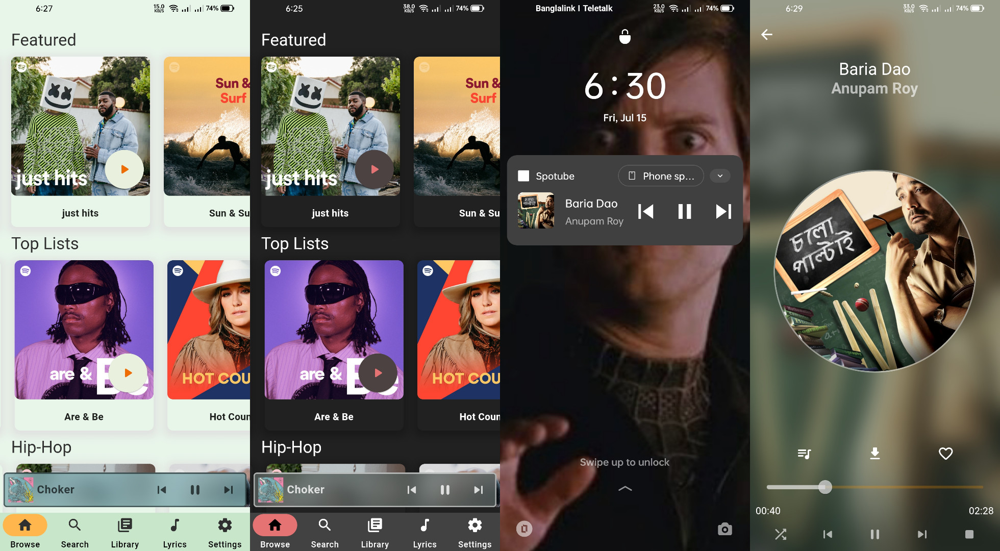

  
  
  
  
  

Spotube is a [Flutter](https://flutter.dev) based lightweight spotify client. It utilizes the power of Spotify & Youtube's public API & creates a hazardless, performant & resource friendly User Experience
#### 
Desktop

#### 
Mobile

# Features

Following are the features that currently spotube offers:

- Open Source
- Anonymous/Guest Login
- Cross platform
- No telemetry, diagnostics or user data collection
- Lightweight & resource friendly
- Native performance (Thanks to Flutter+Skia)
- Playback control is on user's machine instead of server based
- Small size & less data hungry
- No spotify or youtube ads since it uses all public & free APIs (But it's recommended to support the creators by watching/liking/subscribing to the artists youtube channel or add as favourite track in spotify. Mostly buying spotify premium is the best way to support their valuable creations)
- Synced Lyrics
- Downloadable track

# Installation

I'm always releasing newer versions of binary of the software each 2-3 month with minor changes & each 6-8 month with major changes. Grab the binaries

| Platform             | Package/Installation Method                                                                                                                                                                                                                                                                    |
| -------------------- | ---------------------------------------------------------------------------------------------------------------------------------------------------------------------------------------------------------------------------------------------------------------------------------------------- |
| Android              | [][android-dlink]                                                                                                                                                |
| Debian/Ubuntu        | [][deb-dlink]   Then run: `sudo apt install Spotube-linux-x86_64.deb`                                                     |
| Flatpak              | `flatpak install com.github.KRTirtho.Spotube`                                                          |
| Arch/Manjaro         | pamac: `pamac install spotube-bin`   yay: `yay -Sy spotube-bin`                                                                                                                                                                                                                            |
| AppImage             | [][appimage-dlink]  **Note**: AppImages require [appimage-launcher](https://github.com/TheAssassin/AppImageLauncher) to be installed |
| Linux (tarball)      | [][linux-dlink]                                                                                                                           |
| Windows              | [][win32-dlink]                                                                                                                                                 |
| Windows (Chocolatey) | `choco install spotube`                                                                                                                                                                                                                                                                        |
| Windows (WinGet)     | `winget install --id KRTirtho.Spotube`                                                                                                                                                                                                                                                         |
| MacOS                | [][mac-dlink]                                                                                                                                                            |

> **Note!:** If you don't understand this download table. You can read [installation instructions][wiki-installation-instructions] from the wiki

## Nightly Builds
Get the latest nightly builds of Spotube [here](https://nightly.link/KRTirtho/spotube/workflows/flutter-build/build)

## Optional Configurations
### Login with <b>Spotify</b>
  You need a spotify account & a developer app for

  - clientId
  - clientSecret

  **Grab credentials:**

  - Go to https://developer.spotify.com/dashboard/login & login with your spotify account (Skip if you're logged in)
    

  - Create an web app for Spotify Public API 
    

  - **MOST IMPORTANT:** Give the app a name & description. Then Edit settings & add `http://localhost:4304/auth/spotify/callback` as **Redirect URI** for the app. Its important for authenticating 
    

  - Click on **SHOW CLIENT SECRET** to reveal the **clientSecret**. Then copy the **clientID**, **clientSecret** & paste in the **Spotube's** respective fields 
    

### Setup <b>Genius Lyrics</b>

- Signup/Login into [genius](https://genius.com/signup) for **lyrics**
- Go To [Genius Developer Portal](https://genius.com/api-clients/new) for creating an API client 
  
- Generate & copy access token 
  
- Paste the copied access token in Spotube's Settings 
  

> **Note!**: No personal data or any kind of sensitive information won't be collected from spotify. Don't believe? See the code for yourself

# TODO:

- [x] Compile, Debug & Build for **MacOS**
- [x] Add support for show Lyric of currently playing track
- [x] Track download
- [ ] Support for playing/streaming podcasts/shows
- [x] Artist, User & Album pages
- [x] Android Support

# Building from source

You can find the details [here](CONTRIBUTION.md#your-first-code-contribution)

# Things that don't work

- Shows & Podcasts aren't supported as it'd require premium anyway
- OS Media Controls

# License

[BSD-4-Clause](/LICENSE)

Bu why? You can learn about it [here](https://dev.to/krtirtho/choosing-open-source-license-wisely-1m3p)

# Library/Plugin/Framework Credits

- [Flutter](https://flutter.dev/) - Flutter transforms the app development process. Build, test, and deploy beautiful mobile, web, desktop, and embedded apps from a single codebase
- [Linux](https://www.linux.org/) - Linux is a family of open-source Unix-like operating systems based on the Linux kernel, an operating system kernel first released on September 17, 1991, by Linus Torvalds. Linux is typically packaged in a Linux distribution
- [AUR](https://aur.archlinux.org/) - AUR stands for Arch User Repository. It is a community-driven repository for Arch-based Linux distributions users
- [Flatpak](https://flatpak.org/) - Flatpak is a utility for software deployment and package management for Linux
- [spotify (dart)](https://github.com/rinukkusu/spotify-dart) - A dart library for interfacing with the Spotify API
- [just_audio](https://github.com/ryanheise/just_audio/tree/master/just_audio) - A feature-rich cross-platform audio player for Flutter that supports network audio streams too
- [libwinmedia](https://github.com/harmonoid/libwinmedia) - A cross-platform media playback library for C/C++ with good number of features (only Windows & Linux)
- [youtube_explode_dart](https://github.com/Hexer10/youtube_explode_dart) - YoutubeExplode is a library that provides an interface to query metadata of YouTube videos, playlists and channels, as well as to resolve and download video streams and closed caption tracks
- [infinite_scroll_pagination](https://github.com/EdsonBueno/infinite_scroll_pagination) - Flutter package to help you lazily load and display pages of items as the user scrolls down your screen
- [bitsdojo_window](https://github.com/bitsdojo/bitsdojo_window) - A Flutter package that makes it easy to customize and work with your Flutter desktop app window on Windows, macOS and Linux
- [hotkey_manager](https://github.com/leanflutter/hotkey_manager) - A flutter plugin that allow Flutter desktop apps to defines system/inapp wide hotkey
- [Inno Setup](https://jrsoftware.org/isinfo.php) - Inno Setup is a free installer for Windows programs by Jordan Russell and Martijn Laan
- [collection](https://github.com/dart-lang/collection) - The collection package for Dart contains a number of separate libraries with utility functions and classes that makes working with collections easier 
- [flutter_riverpod](https://riverpod.dev/) - A Reactive Caching and Data-binding Framework
- [flutter_hooks](https://github.com/rrousselGit/flutter_hooks) - React hooks for Flutter. Hooks are a new kind of object that manages a Widget life-cycles. They are used to increase code sharing between widgets and as a complete replacement for StatefulWidget
- [hooks_riverpod](https://riverpod.dev/) - Riverpod with hooks
- [go_router](https://github.com/flutter/packages/tree/main/packages/go_router) - A declarative router for Flutter based on Navigation 2 supporting deep linking, data-driven routes and more
- [palette_generator](https://github.com/flutter/packages/tree/main/packages/palette_generator) - Flutter package for generating palette colors from a source image.
- [audio_session](https://github.com/ryanheise/audio_session) - Sets the iOS audio session category and Android audio attributes for your app, and manages your app's audio focus, mixing and ducking behaviour.
- [logger](https://github.com/leisim/logger) - Small, easy to use and extensible logger which prints beautiful logs
- [flutter_launcher_icons](https://github.com/fluttercommunity/flutter_launcher_icons) - A package which simplifies the task of updating your Flutter app's launcher icon.
- [permission_handler](https://github.com/baseflow/flutter-permission-handler) - Permission plugin for Flutter. This plugin provides a cross-platform (iOS, Android) API to request and check permissions. 
- [marquee](https://github.com/MarcelGarus/marquee) - ⏩ A Flutter widget that scrolls text infinitely. Provides many customizations including custom scroll directions, durations, curves as well as pauses after every round
- [scroll_to_index](https://github.com/quire-io/scroll-to-index) - scroll to index with fixed/variable row height inside Flutter scrollable widget 
- [package_info_plus](https://github.com/fluttercommunity/plus_plugins/tree/main/packages/) - This Flutter plugin provides an API for querying information about an application package.

# Social handlers

Follow me on [Twitter](https://twitter.com/@krtirtho) for newer updates about this application

&copy; 2022 Spotube

<!-- Variables/Text References -->
[win32-dlink]: https://github.com/KRTirtho/spotube/releases/latest/download/Spotube-windows-x86_64-setup.exe
[deb-dlink]: https://github.com/KRTirtho/spotube/releases/latest/download/Spotube-linux-x86_64.deb
[linux-dlink]: https://github.com/KRTirtho/spotube/releases/latest/download/Spotube-linux-x86_64.tar.xz
[appimage-dlink]: https://github.com/KRTirtho/spotube/releases/latest/download/Spotube-linux-x86_64.AppImage
[mac-dlink]: https://github.com/KRTirtho/spotube/releases/latest/download/Spotube-macos-x86_64.dmg
[android-dlink]: https://github.com/KRTirtho/spotube/releases/latest/download/Spotube-android-all-arch.apk

[wiki-installation-instructions]: https://github.com/KRTirtho/spotube/wiki/Installation-Instrcutions