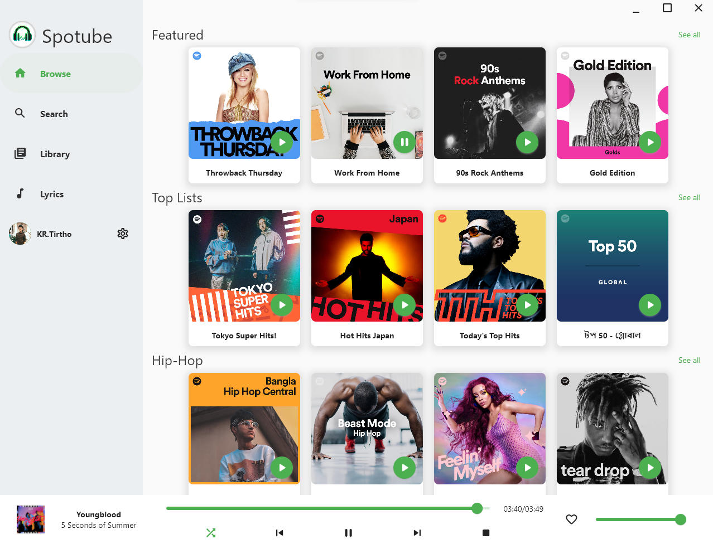

Spotube is a [Flutter](https://flutter.dev) based lightweight spotify client. It utilizes the power of Spotify & Youtube's public API & creates a hazardless, performant & resource friendly User Experience


# Features

Following are the features that currently spotube offers:

- Open Source
- No telementry, diagnostics or user data collection
- Lightweight & resource friendly
- Native performance (Thanks to Flutter+Skia)
- Playback control is on user's machine instead of server based
- Small size & less data hungry
- No spotify or youtube ads since it uses all public & free APIs (But it's recommended to support the creators by watching/liking/subscribing to the artists youtube channel or add as favourite track in spotify. Mostly buying spotify premium is the best way to support their valuable creations)
- Lyrics
- Downloadable track (WIP)

# Installation

I'm always releasing newer versions of binary of the software each 2-3 month with minor changes & each 6-8 month with major changes. Grab the binaries

All the binaries are located in the [releases](https://github.com/krtirtho/spotube/releases), just download

## Windows

Download the [setup file](https://github.com/KRTirtho/spotube/releases/download/v1.0.1/Spotube-windows-x86_64-setup.exe) & follow along the installer

### Chocolatey

Run the following command to install Spotube with windows chocolatey package manager
```powershell
choco install spotube
```

### Winget
Run the following command to install Spotube with new Windows Package Manager:
```powershell
winget install --id KRTirtho.Spotube
```

## Linux

### Ubuntu/Debian/Linux Mint/Pop_!OS:
  Download the [Spotube-linux-x86_64.deb](https://github.com/KRTirtho/spotube/releases/download/v1.0.1/Spotube-linux-x86_64.deb) then double click it or run
  ```bash
  $ sudo apt install Spotube-linux-x86_64.deb
  # or
  $ sudo dpkg -i Spotube-linux-x86_64.deb
  ```
  in the directory where it was downloaded


### Arch/Manjaro/Endeavour:
  Run following terminal
  ```bash
  # for `yay` users
  $ yay -S spotube
  # for `pamac` users
  $ pamac install spotube
  ```


### Others:
   Download the [Spotube-linux-x86_64.AppImage](https://github.com/KRTirtho/spotube/releases/download/v1.0.1/Spotube-linux-x86_64.AppImage) file & double click to run it. AppImages require [appimage-launcher](https://github.com/TheAssassin/AppImageLauncher) to be installed

**I'll/try to upload the package binaries to linux debian/arch/ubuntu/snap/flatpack/redhat/chocolatey stores or software centers or repositories**

# Configuration

There are some configurations that needs to be done to start using this software

You need a spotify account & a developer app for

- clientId
- clientSecret

**Grab credentials:**

- Go to https://developer.spotify.com/dashboard/login & login with your spotify account (Skip if you're logged in)
  

- Create an web app for Spotify Public API
  

- Give the app a name & description. Then Edit settings & add **http://localhost:4304/auth/spotify/callback** as **Redirect URI** for the app. Its important for authenticating
  

- Click on **SHOW CLIENT SECRET** to reveal the **clientSecret**. Then copy the **clientID**, **clientSecret** & paste in the **Spotube's** respective fields
  

Also, you need a [genius](https://genius.com) account for **lyrics** & a API Client for

- accessToken

> **Note!**: No personal data or any kind of sensitive information won't be collected from spotify. Don't believe? See the code for yourself

# TODO:

- [ ] Compile, Debug & Build for **MacOS**
- [x] Add support for show Lyric of currently playing track
- [ ] Track download
- [ ] Support for playing/streaming podcasts/shows
- [ ] Artist, User & Album pages

# Building from source

- Download the latest Flutter SDK (>=2.15.1) & enable desktop support
- Install Development dependencies in linux
  - `libwebkit2gtk-4.0-dev`, `libkeybinder-3.0-0` & `libkeybinder-3.0-0-dev` (for Debian/Ubuntu)
  - `webkit2gtk` & `libkeybinder3` (for Arch/Manjaro)
- Clone the Repo

```bash
$ flutter pub get
$ flutter run -d <window|macos|linux>
```

# Things that don't work

- Shows & Podcasts aren't supported as it'd require premium anyway
- OS Media Controls
- Global Media Shortcuts/Keyboard Media Buttons

# License

[BSD 4-Clause](/LICENSE)

Bu why? You can learn about it [here](https://dev.to/krtirtho/choosing-open-source-license-wisely-1m3p)

# Relevant Project/Tools Links

- [Flutter](https://flutter.dev/) - Flutter transforms the app development process. Build, test, and deploy beautiful mobile, web, desktop, and embedded apps from a single codebase
- [Linux](https://www.linux.org/) - Linux is a family of open-source Unix-like operating systems based on the Linux kernel, an operating system kernel first released on September 17, 1991, by Linus Torvalds. Linux is typically packaged in a Linux distribution
- [AUR](https://aur.archlinux.org/) - AUR stands for Arch User Repository. It is a community-driven repository for Arch-based Linux distributions users
- [Flatpak](https://flatpak.org/) - Flatpak is a utility for software deployment and package management for Linux
- [spotify (dart)](https://github.com/rinukkusu/spotify-dart) - A dart library for interfacing with the Spotify API
- [just_audio](https://github.com/ryanheise/just_audio/tree/master/just_audio) - A feature-rich cross-platform audio player for Flutter that supports network audio streams too
- [libwinmedia](https://github.com/harmonoid/libwinmedia) - A cross-platform media playback library for C/C++ with good number of features (only Windows & Linux)
- [youtube_explode_dart](https://github.com/Hexer10/youtube_explode_dart) - YoutubeExplode is a library that provides an interface to query metadata of YouTube videos, playlists and channels, as well as to resolve and download video streams and closed caption tracks
- [infinite_scroll_pagination](https://github.com/EdsonBueno/infinite_scroll_pagination) - Flutter package to help you lazily load and display pages of items as the user scrolls down your screen
- [bitsdojo_window](https://github.com/bitsdojo/bitsdojo_window) - A Flutter package that makes it easy to customize and work with your Flutter desktop app window on Windows, macOS and Linux
- [hotkey_manager](https://github.com/leanflutter/hotkey_manager) - A flutter plugin that allow Flutter desktop apps to defines system/inapp wide hotkey
- [Inno Setup](https://jrsoftware.org/isinfo.php) - Inno Setup is a free installer for Windows programs by Jordan Russell and Martijn Laan


# Social handlers

Follow me on [Twitter](https://twitter.com/@krtirtho) for newer updates about this application


<p align="center">&copy; 2022 Spotube</p>