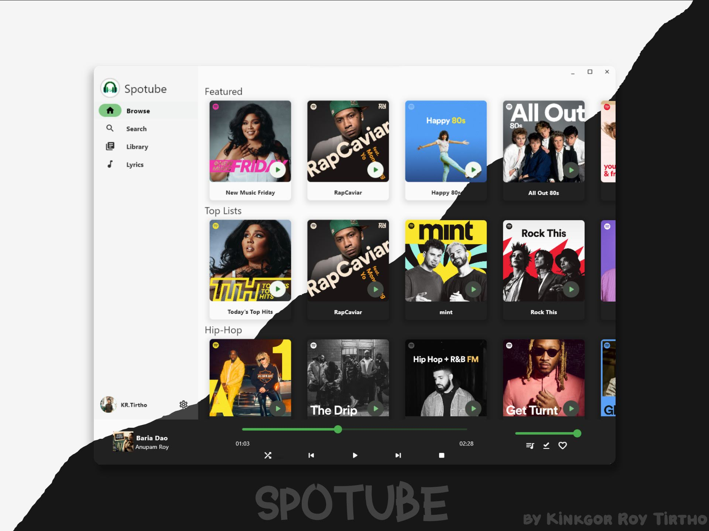

  

  An open source, cross-platform Spotify client that doesn't require Premium nor uses Electron! 

  
  

  
  

  

  ---

   

## 🌃 Features

- 🚫 No Spotify nor YouTube ads, utilizing public and free Spotify and YT Music APIs¹
- ⬇️ Downloadable tracks
- 🖥️ 📱 Cross-platform support
- 🪶 Small size & less data usage
- 🕵️ Anonymous/guest login
- 🕒 Time synced lyrics
- ✋ No telemetry, diagnostics or user data collection
- 🚀 Native performance
- 📖 Open source/libre software
- 🎵 Playback control is done locally instead of on the server

**¹** It is still **recommended** to support the creators by watching/liking/subscribing to the artists' YouTube channels or liking their tracks on Spotify (or purchasing a Spotify Premium subscription too).

## Installation

I'm always releasing newer versions of binaries of the software every 2-3 months with minor changes & every 6-8 months with major changes. Grab them!

| Platform                                        | Package/Installation Method                                                                                                                                                                                                                                                                                                     |
| ----------------------------------------------- | ------------------------------------------------------------------------------------------------------------------------------------------------------------------------------------------------------------------------------------------------------------------------------------------------------------------------------- |
| Android                                         | [][android-dlink] [][fdroid-dlink]       |
| Debian/Ubuntu                                   | [][deb-dlink]   Then run: `sudo apt install Spotube-linux-x86_64.deb`                                                                                      |
| Fedora/OpenSuse                                 | [][rpm-dlink]   For Fedora: `sudo dnf install ./Spotube-linux-x86_64.rpm`  For OpenSuse: `sudo zypper in ./Spotube-linux-x86_64.rpm` |
| Flatpak                                         | `flatpak install com.github.KRTirtho.Spotube`                                                                                           |
| Arch/Manjaro                                    | pamac: `pamac install spotube-bin`   yay: `yay -Sy spotube-bin`                                                                                                                                                                                                                                                             |
| AppImage                                        | [][appimage-dlink]  **Note**: AppImages require [appimage-launcher](https://github.com/TheAssassin/AppImageLauncher) to be installed                                  |
| Linux (tarball)                                 | [][linux-dlink]                                                                                                                                                            |
| Windows                                         | [][win32-dlink]                                                                                                                                                                                  |
| Windows (<a href="https://chocolatey.org">Chocolatey</a>)                            | `choco install spotube`                                                                                                                                                                                                                                                                                                         |
| Windows (<a href="https://scoop.sh/">Scoop</a>) | `scoop bucket add extras`    `scoop install spotube`                                                                                                                                                                                                                                                                        |
| Windows (<a href="https://github.com/microsoft/winget-cli">WinGet</a>)                           | `winget install --id KRTirtho.Spotube`                                                                                                                                                                                                                                                                                          |
| MacOS                                           | [][mac-dlink]                                                                                                                                                                                             |

> If you don't understand this download table. You can read [installation instructions][wiki-installation-instructions] from the wiki

### Nightly Builds

Grab the latest nightly builds of Spotube [from the GitHub Releases](https://github.com/KRTirtho/spotube/releases/tag/nightly).

## Building from source 

You can [read the instructions](CONTRIBUTION.md#your-first-code-contribution).

<!--            I want it differently

## Things that do not work

- Shows & Podcasts are not supported, as a premium subscription would be needed for that functionality.

-->

## The Spotube team

- [Kingkor Roy Tirtho](https://github.com/KRTirtho) - The Founder, Maintainer and Lead Developer
- [Owen Conor](https://github.com/owencz1998) - The Cool Discord Moderator
- [Piotr Rogowski](https://github.com/karniv00l) - The MacOS Developer
- [RaptaG](https://github.com/raptag) - The GitHub Moderator and Community Manager
- [Rusty Apple](https://github.com/RustyApple) - The Mysterious Unknown Guy

## License

Spotube is open source and licensed under the [BSD-4-Clause](/LICENSE) License.

If you are concerned, feel free to [read the reason of choosing this license.](https://dev.to/krtirtho/choosing-open-source-license-wisely-1m3p).

## Library/Plugin/Framework Credits

1. [Flutter](https://flutter.dev/) - Flutter transforms the app development process. Build, test, and deploy beautiful mobile, web, desktop, and embedded apps from a single codebase
1. [Spotify API](https://developer.spotify.com/documentation/web-api/) - The Spotify Web API is a RESTful API that provides access to Spotify data
1. [Linux](https://www.linux.org/) - Linux is a family of open-source Unix-like operating systems based on the Linux kernel, an operating system kernel first released on September 17, 1991, by Linus Torvalds. Linux is typically packaged in a Linux distribution
1. [AUR](https://aur.archlinux.org/) - AUR stands for Arch User Repository. It is a community-driven repository for Arch-based Linux distributions users
1. [Flatpak](https://flatpak.org/) - Flatpak is a utility for software deployment and package management for Linux
1. [rentanadviser](https://www.rentanadviser.com/) - Generous Synced lyrics API provider service
1. [SponsorBlock](https://sponsor.ajay.app/) - SponsorBlock is an open-source crowdsourced browser extension and open API for skipping sponsor segments in YouTube videos.
1. [Inno Setup](https://jrsoftware.org/isinfo.php) - Inno Setup is a free installer for Windows programs by Jordan Russell and Martijn Laan
1. [F-Droid](https://f-droid.org/) - F-Droid is an installable catalogue of FOSS (Free and Open Source Software) applications for the Android platform. The client makes it easy to browse, install, and keep track of updates on your device

1. [adwaita](https://github.com/gtk-flutter/adwaita) - Adwaita style - The default theme for GTK+ for your Flutter app.
1. [args](https://pub.dev/packages/args) - Library for defining parsers for parsing raw command-line arguments into a set of options and values using GNU and POSIX style options.
1. [async](https://pub.dev/packages/async) - Utility functions and classes related to the 'dart:async' library.
1. [audio_service](https://github.com/ryanheise/audio_service/tree/master/audio_service) - Flutter plugin to play audio in the background while the screen is off.
1. [audio_session](https://github.com/ryanheise/audio_session) - Sets the iOS audio session category and Android audio attributes for your app, and manages your app's audio focus, mixing and ducking behaviour.
1. [audioplayers](https://github.com/bluefireteam/audioplayers) - A Flutter plugin to play multiple audio files simultaneously
1. [auto_size_text](https://github.com/leisim/auto_size_text) - Flutter widget that automatically resizes text to fit perfectly within its bounds.
1. [badges](https://pub.dev/packages/badges) - A package for creating badges. Badges can be used for an additional marker for any widget, e.g. show a number of items in a shopping cart.
1. [cached_network_image](https://github.com/Baseflow/flutter_cached_network_image) - Flutter library to load and cache network images. Can also be used with placeholder and error widgets.
1. [collection](https://pub.dev/packages/collection) - Collections and utilities functions and classes related to collections.
1. [cupertino_icons](https://pub.dev/packages/cupertino_icons) - Default icons asset for Cupertino widgets based on Apple styled icons
1. [dbus](https://github.com/canonical/dbus.dart) - A native Dart implementation of the D-Bus message bus client. This package allows Dart applications to directly access services on the Linux desktop.
1. [file_picker](https://github.com/miguelpruivo/plugins_flutter_file_picker) - A package that allows you to use a native file explorer to pick single or multiple absolute file paths, with extension filtering support.
1. [fl_query](https://fl-query.vercel.app) - Asynchronous data caching, refetching & invalidation library for Flutter
1. [fl_query_hooks](https://fl-query.vercel.app) - Elite flutter_hooks compatible library for fl_query, the Asynchronous data caching, refetching & invalidation library for Flutter
1. [fluent_ui](https://github.com/bdlukaa/fluent_ui) - Implements Windows UI in Flutter. Based on the official documentation
1. [fluentui_system_icons](https://github.com/microsoft/fluentui-system-icons/tree/main) - Fluent UI System Icons are a collection of familiar, friendly and modern icons from Microsoft.
1. [flutter_cache_manager](https://github.com/Baseflow/flutter_cache_manager/tree/master/flutter_cache_manager) - Generic cache manager for flutter. Saves web files on the storages of the device and saves the cache info using sqflite.
1. [flutter_dotenv](https://github.com/java-james/flutter_dotenv) - Easily configure any flutter application with global variables using a `.env` file.
1. [flutter_feather_icons](https://github.com/muj-programmer/flutter_feather_icons) - Feather is a collection of simply beautiful open source icons. Each icon is designed on a 24x24 grid with an emphasis on simplicity, consistency and usability.
1. [flutter_hooks](https://github.com/rrousselGit/flutter_hooks) - A flutter implementation of React hooks. It adds a new kind of widget with enhanced code reuse.
1. [flutter_inappwebview](https://inappwebview.dev/) - A Flutter plugin that allows you to add an inline webview, to use an headless webview, and to open an in-app browser window.
1. [flutter_riverpod](https://riverpod.dev) - A simple way to access state from anywhere in your application while robust and testable.
1. [flutter_svg](https://pub.dev/packages/flutter_svg) - An SVG rendering and widget library for Flutter, which allows painting and displaying Scalable Vector Graphics 1.1 files.
1. [fuzzywuzzy](https://github.com/sphericalkat/dart-fuzzywuzzy) - An implementation of the popular fuzzywuzzy package in Dart, to suit all your fuzzy string matching/searching needs!
1. [go_router](https://pub.dev/packages/go_router) - A declarative router for Flutter based on Navigation 2 supporting deep linking, data-driven routes and more
1. [hive](https://github.com/hivedb/hive/tree/master/hive) - Lightweight and blazing fast key-value database written in pure Dart. Strongly encrypted using AES-256.
1. [hive_flutter](https://github.com/hivedb/hive/tree/master/hive_flutter) - Extension for Hive. Makes it easier to use Hive in Flutter apps.
1. [hooks_riverpod](https://riverpod.dev) - A simple way to access state from anywhere in your application while robust and testable.
1. [html](https://pub.dev/packages/html) - APIs for parsing and manipulating HTML content outside the browser.
1. [http](https://pub.dev/packages/http) - A composable, multi-platform, Future-based API for HTTP requests.
1. [introduction_screen](https://github.com/pyozer/introduction_screen) - Introduction/Onboarding package for flutter app with some customizations possibilities
1. [json_annotation](https://pub.dev/packages/json_annotation) - Classes and helper functions that support JSON code generation via the `json_serializable` package.
1. [json_serializable](https://pub.dev/packages/json_serializable) - Automatically generate code for converting to and from JSON by annotating Dart classes.
1. [libadwaita](https://github.com/gtk-flutter/libadwaita) - Libadwaita's widgets for Flutter. Following Gnome HIG and available on all platforms.
1. [logger](https://pub.dev/packages/logger) - Small, easy to use and extensible logger which prints beautiful logs.
1. [macos_ui](https://macosui.dev) - Flutter widgets and themes implementing the current macOS design language.
1. [marquee](https://pub.dev/packages/marquee) - A Flutter widget that scrolls text infinitely. Provides many customizations including custom scroll directions, durations, curves as well as pauses after every round.
1. [metadata_god](https://github.com/KRTirtho/metadata_god) - Plugin for retrieving and writing audio tags/metadata from audio files
1. [mime](https://pub.dev/packages/mime) - Utilities for handling media (MIME) types, including determining a type from a file extension and file contents.
1. [package_info_plus](https://plus.fluttercommunity.dev/) - Flutter plugin for querying information about the application package, such as CFBundleVersion on iOS or versionCode on Android.
1. [palette_generator](https://pub.dev/packages/palette_generator) - Flutter package for generating palette colors from a source image.
1. [path](https://pub.dev/packages/path) - A string-based path manipulation library. All of the path operations you know and love, with solid support for Windows, POSIX (Linux and Mac OS X), and the web.
1. [path_provider](https://pub.dev/packages/path_provider) - Flutter plugin for getting commonly used locations on host platform file systems, such as the temp and app data directories.
1. [permission_handler](https://pub.dev/packages/permission_handler) - Permission plugin for Flutter. This plugin provides a cross-platform (iOS, Android) API to request and check permissions.
1. [pocketbase](https://pub.dev/packages/pocketbase) - Multi-platform Dart SDK for PocketBase, an open source realtime backend in 1 file.
1. [popover](https://github.com/minikin/popover) - A popover is a transient view that appears above other content onscreen when you tap a control or in an area.
1. [queue](https://github.com/rknell/dart_queue) - Queue up futures from multiple sources and await their return anywhere in your code.
1. [scroll_to_index](https://github.com/quire-io/scroll-to-index) - Scroll to a specific child of any scrollable widget in Flutter
1. [shared_preferences](https://pub.dev/packages/shared_preferences) - Flutter plugin for reading and writing simple key-value pairs. Wraps NSUserDefaults on iOS and SharedPreferences on Android.
1. [skeleton_text](https://github.com/101Loop/Skeleton-Text) - A package that provides an easy way to add skeleton text loading animation in Flutter project. This project is a part of 101Loop community.
1. [tuple](https://pub.dev/packages/tuple) - A library providing a tuple data structure.
1. [url_launcher](https://pub.dev/packages/url_launcher) - Flutter plugin for launching a URL. Supports web, phone, SMS, and email schemes.
1. [uuid](https://github.com/Daegalus/dart-uuid) - RFC4122 (v1, v4, v5) UUID Generator and Parser for all Dart platforms (Web, VM, Flutter)
1. [version](https://github.com/dartninja/version) - Provides a simple class for parsing and comparing semantic versions as defined by http://semver.org/
1. [visibility_detector](https://pub.dev/packages/visibility_detector) - A widget that detects the visibility of its child and notifies a callback.
1. [window_manager](https://github.com/leanflutter/window_manager) - This plugin allows Flutter desktop apps to resizing and repositioning the window.
1. [youtube_explode_dart](https://github.com/Hexer10/youtube_explode_dart) - A port in dart of the youtube explode library. Supports several API functions without the need of Youtube API Key.
1. [build_runner](https://pub.dev/packages/build_runner) - A build system for Dart code generation and modular compilation.
1. [flutter_distributor](https://github.com/leanflutter/flutter_distributor) - A complete tool for packaging and publishing your Flutter apps.
1. [flutter_gen_runner](https://github.com/FlutterGen/flutter_gen) - The Flutter code generator for your assets, fonts, colors, … — Get rid of all String-based APIs.
1. [flutter_launcher_icons](https://github.com/fluttercommunity/flutter_launcher_icons) - A package which simplifies the task of updating your Flutter app's launcher icon.
1. [flutter_lints](https://pub.dev/packages/flutter_lints) - Recommended lints for Flutter apps, packages, and plugins to encourage good coding practices.
1. [hive_generator](https://github.com/hivedb/hive/tree/master/hive_generator) - Extension for Hive. Automatically generates TypeAdapters to store any class.
1. [pub_api_client](https://github.com/leoafarias/pub_api_client) - An API Client for Pub to interact with public package information.
1. [pubspec_parse](https://pub.dev/packages/pubspec_parse) - Simple package for parsing pubspec.yaml files with a type-safe API and rich error reporting.
1. [catcher](https://github.com/jhomlala/catcher) - Plugin for error catching which provides multiple handlers for dealing with errors when they are not caught by the developer.
1. [platform_ui](https://github.com/KRTirtho/platform_ui) - Platform specific Widgets and UI toolkit
1. [spotify](https://github.com/rinukkusu/spotify-dart) - An incomplete dart library for interfacing with the Spotify Web API.
1. [window_size](https://github.com/google/flutter-desktop-embedding.git) - Allows resizing and repositioning the window containing Flutter.

<h4>© Copyright Spotube 2023</h4>

<!-- Variables/Text References -->
[win32-dlink]: https://github.com/KRTirtho/spotube/releases/latest/download/Spotube-windows-x86_64-setup.exe
[deb-dlink]: https://github.com/KRTirtho/spotube/releases/latest/download/Spotube-linux-x86_64.deb
[rpm-dlink]: https://github.com/KRTirtho/spotube/releases/latest/download/Spotube-linux-x86_64.rpm
[linux-dlink]: https://github.com/KRTirtho/spotube/releases/latest
[appimage-dlink]: https://github.com/KRTirtho/spotube/releases/latest/download/Spotube-linux-x86_64.AppImage
[mac-dlink]: https://github.com/KRTirtho/spotube/releases/latest/download/Spotube-macos-x86_64.dmg
[android-dlink]: https://github.com/KRTirtho/spotube/releases/latest/download/Spotube-android-all-arch.apk
[fdroid-dlink]: https://f-droid.org/packages/oss.krtirtho.spotube/

[wiki-installation-instructions]: https://github.com/KRTirtho/spotube/wiki/Installation-Instrcutions
