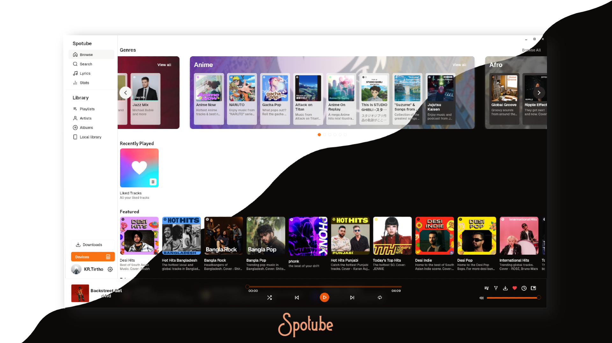
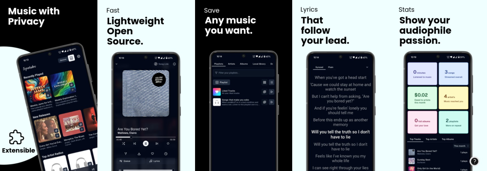

  

A cross-platform extensible open-source music streaming platform. 
Bring your own music metadata/playlist/audio-source with plugins created by community or by yourself. A small step towards the decentralized music streaming era!

---

## 🌃 Features

- 🧩 Plugin powered, supports any platform or custom music service through plugins.
- 🗺️ Community driven plugins for popular platforms or create your own.
- ⬇️ Freely downloadable tracks with tagged metadata.
- 🖥️ 📱 Cross-platform support.
- 🪶 Small size & less data usage.
- 🕒 Time synced lyrics regardless of the plugin support.
- ✋ No telemetry, diagnostics or user data collection.
- 🚀 Native performance.
- 📖 Open source/libre software.
- 🔉 Playback control is done locally, not on the server.

### ⬇️ Download

Download Spotube from the Official Website: https://spotube.cc

### 🔄 Nightly Builds

Grab the latest nightly builds of Spotube [from the Offical Website](https://spotube.cc/downloads/nightly).

## 🕳️ Building from source

You can compile Spotube's source code by [following these instructions](CONTRIBUTION.md#your-first-code-contribution).

## 👥 The Spotube team

- [Kingkor Roy Tirtho](https://github.com/KRTirtho) - The Founder, Maintainer and Lead Developer
- [Owen Connor](https://github.com/owencz1998) - The Cool Discord Moderator
- [Piotr Rogowski](https://github.com/karniv00l) - The MacOS Developer
- [Rusty Apple](https://github.com/RustyApple) - The Mysterious Unknown Guy

## 💼 License

Spotube is open source and licensed under the [AGPL-3.0-or-later](/LICENSE) License.

<h4>© Copyright Spotube 2026</h4>

